# FlappyWorld2
A way more awesome version of Flappy Bird coded in Java. New features include different themes (winter, summer, day, night), 2-player mode, power-ups, and weapons!

This was created using JGrasp as an IDE. To play simply download the repo and execute the following in the terminal:

javac FlappyWorld.java

java FlappyWorld

Screenshots:
<table>
  <tr>
    <td>
      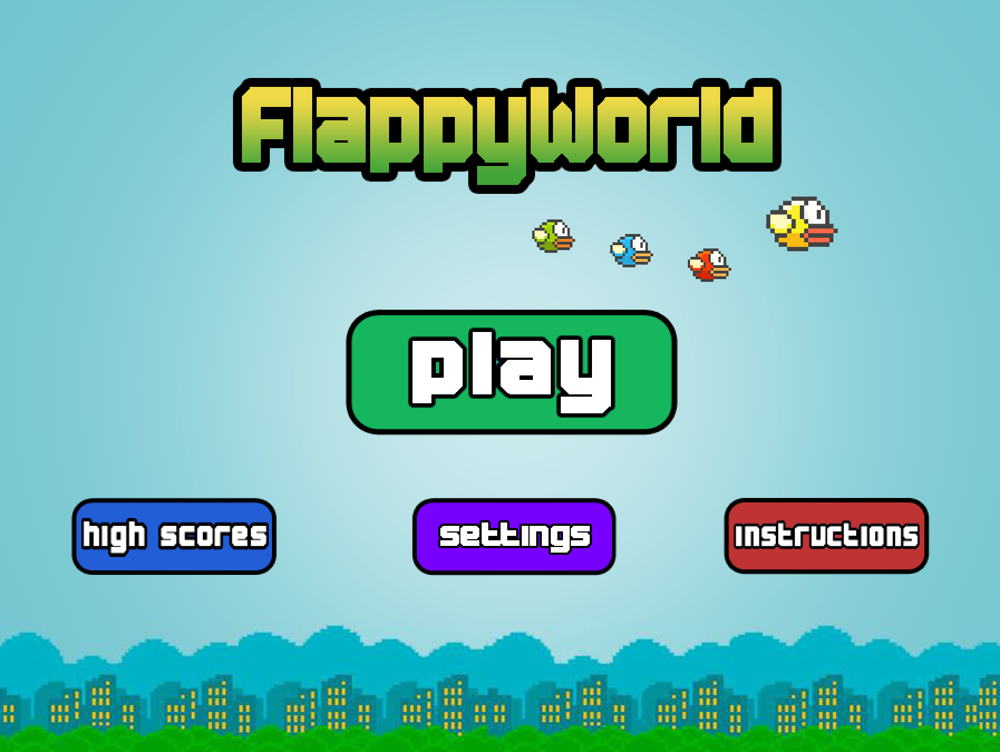
    </td>
    <td>
      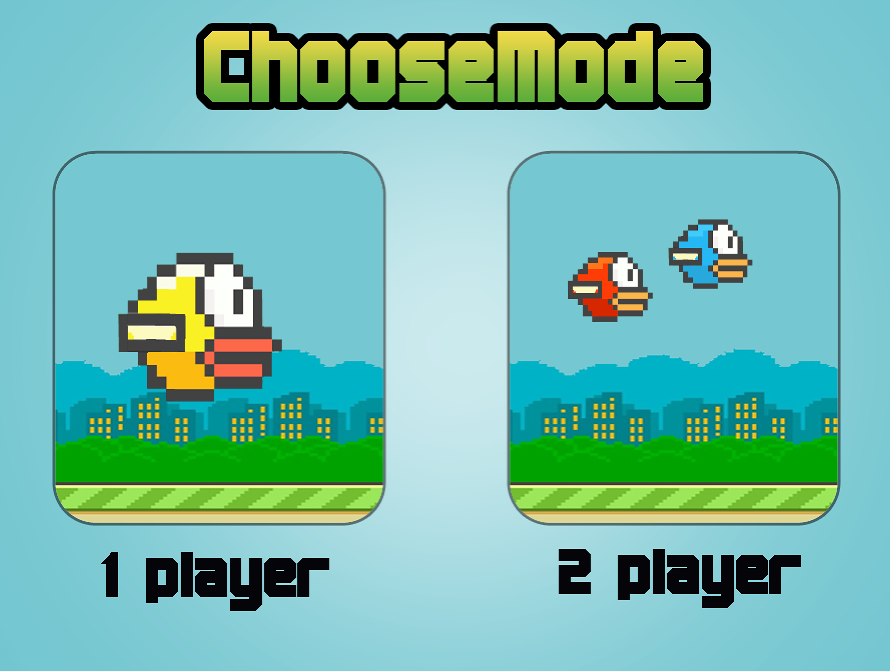
    </td>
    <td>
      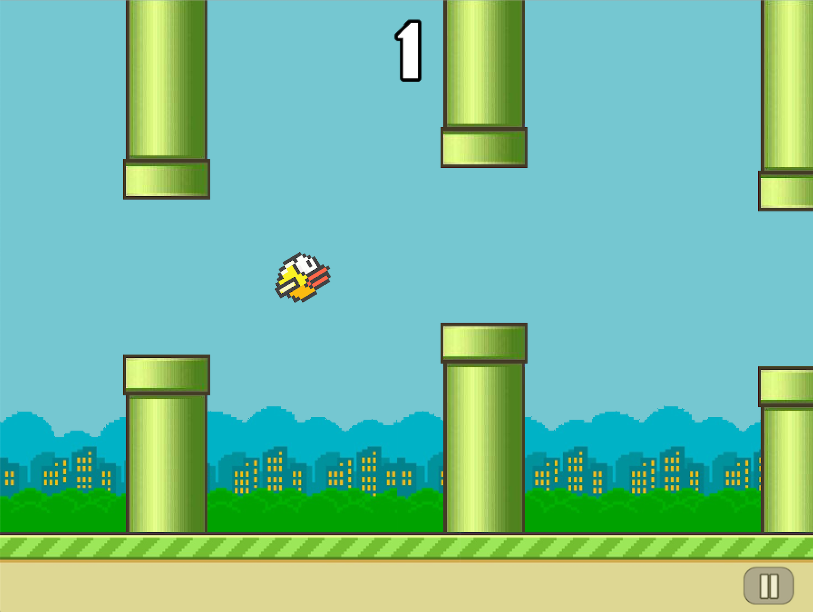
    </td>
    <td>
      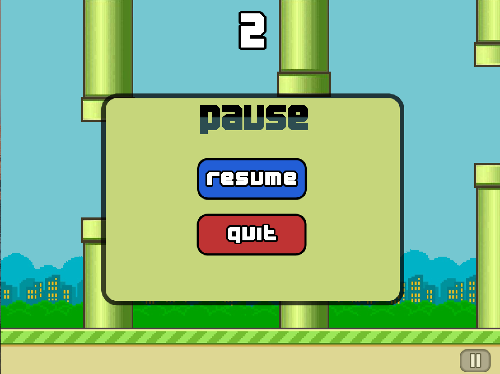
    </td>
  </tr>
  <tr>
    <td>
      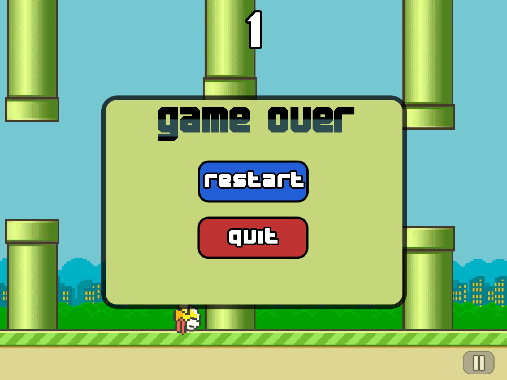
    </td>
    <td>
      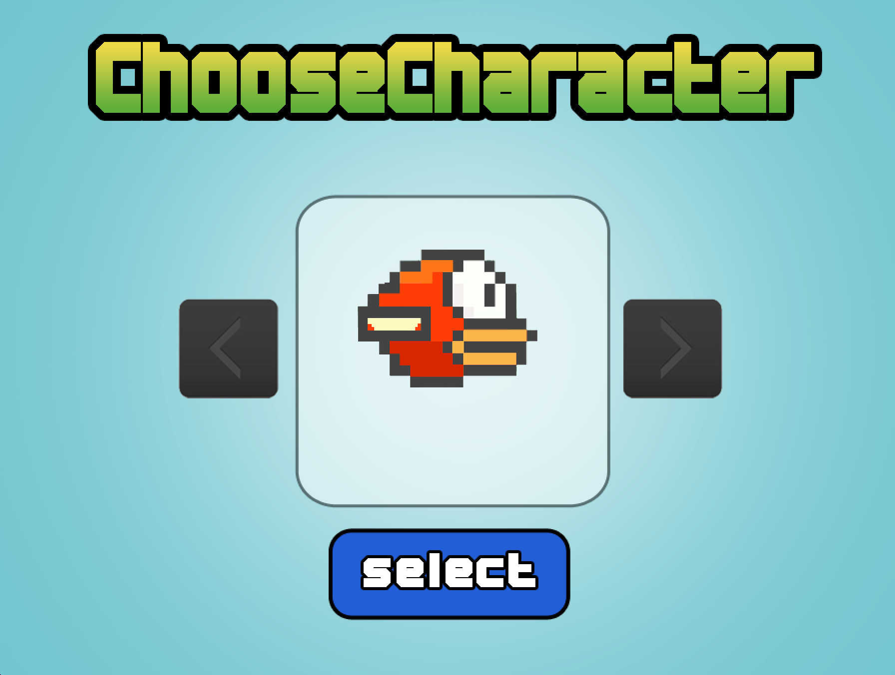
    </td>
    <td>
      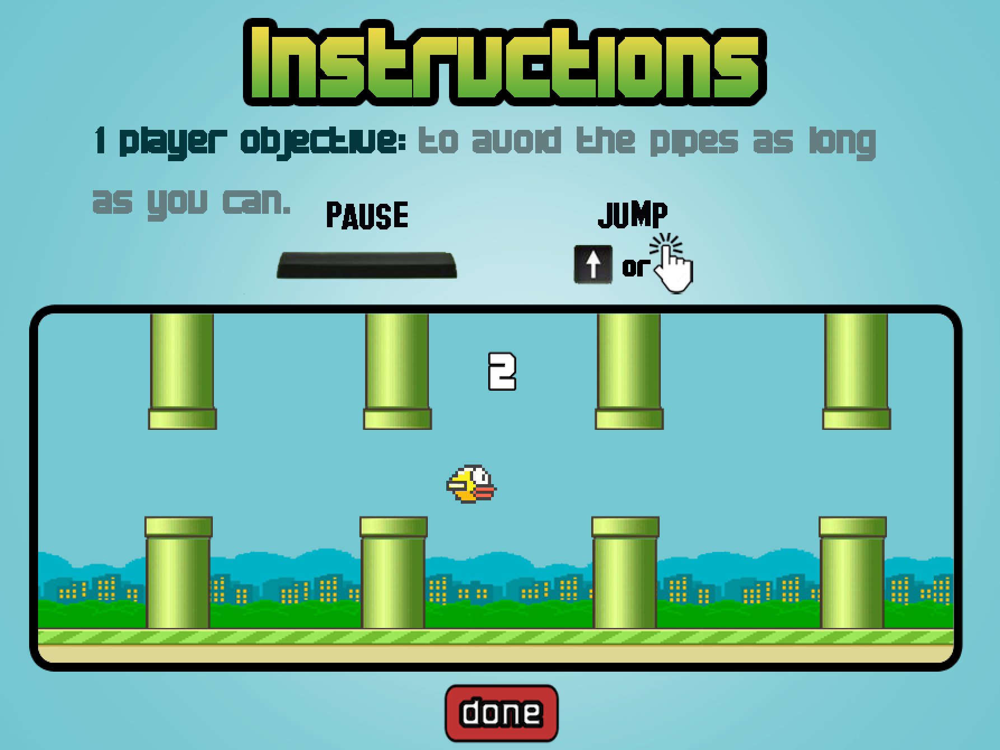
    </td>
    <td>
      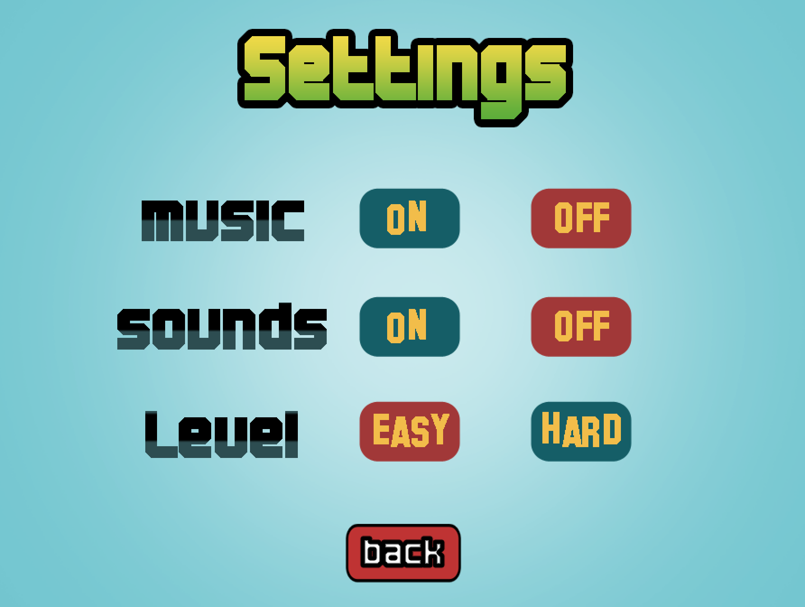
    </td>
  </tr>
</table>

Multi-player mode:
<table>
  <tr>
    <td>
      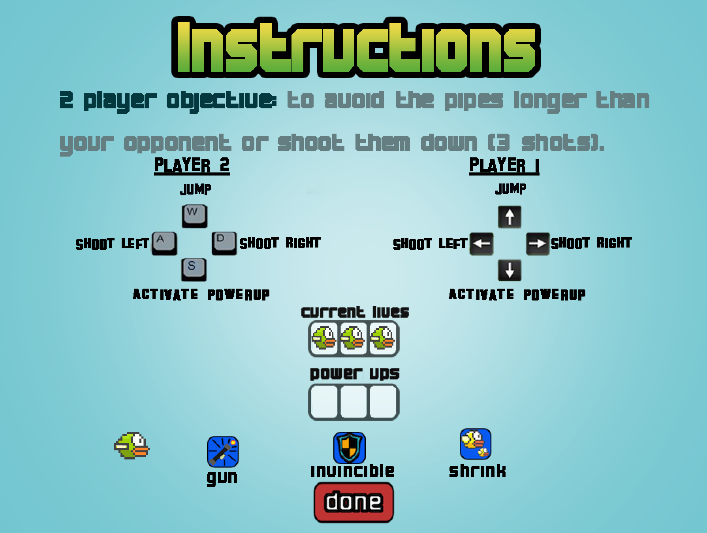
    </td>
    <td>
      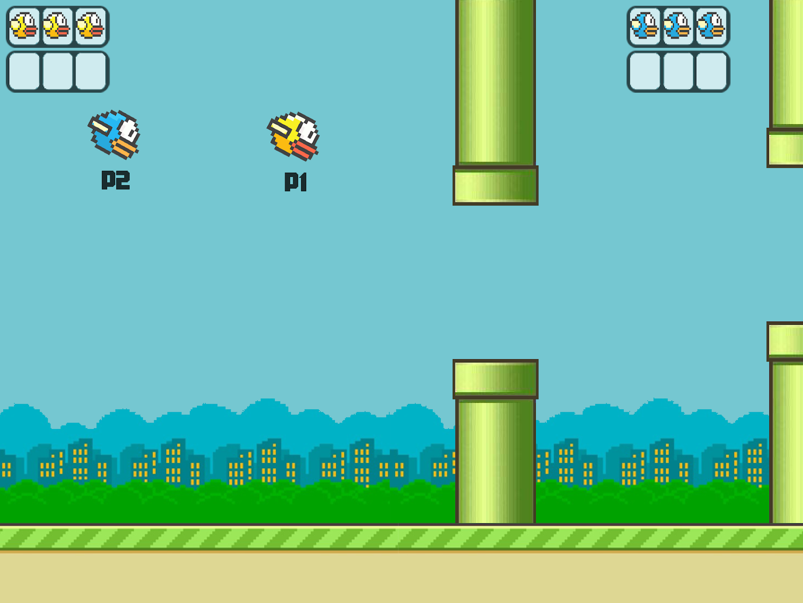
    </td>
    <td>
      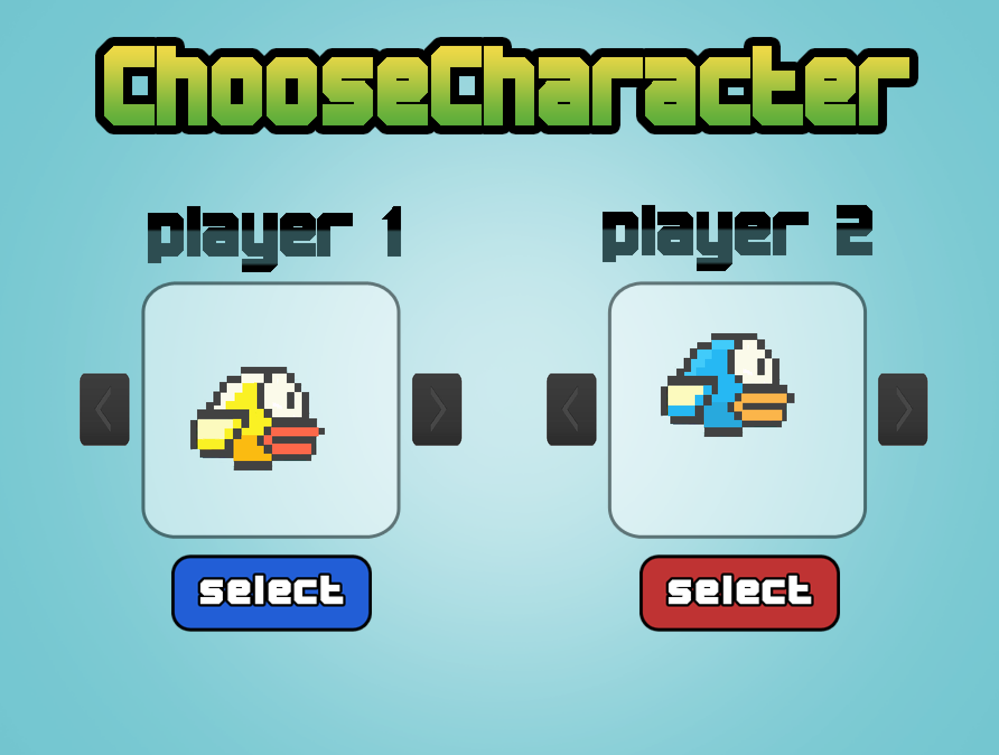
    </td>
  </tr>
</table>

Multiple themes:
<table>
  <tr>
    <td>
      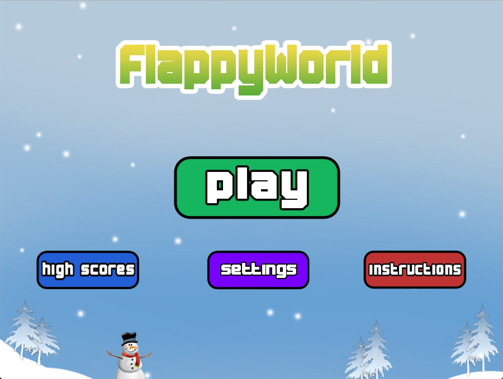
    </td>
    <td>
      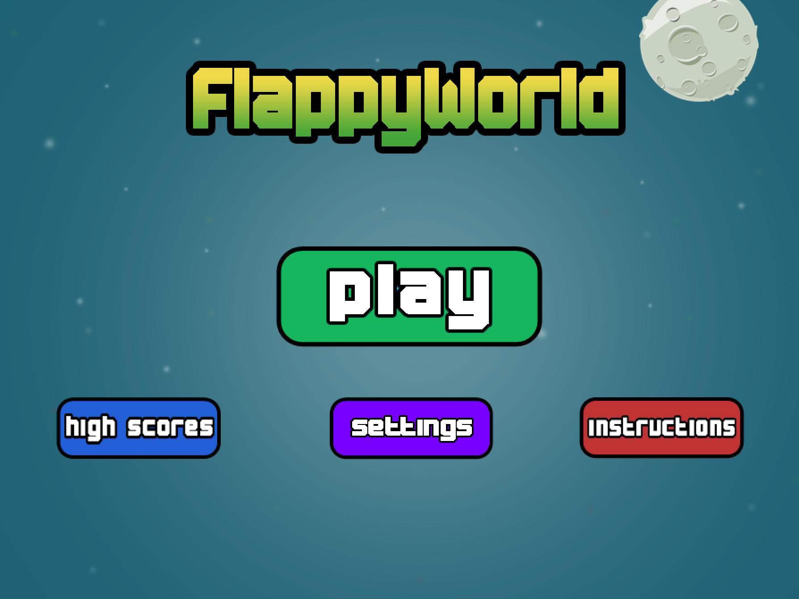
    </td>
    <td>
      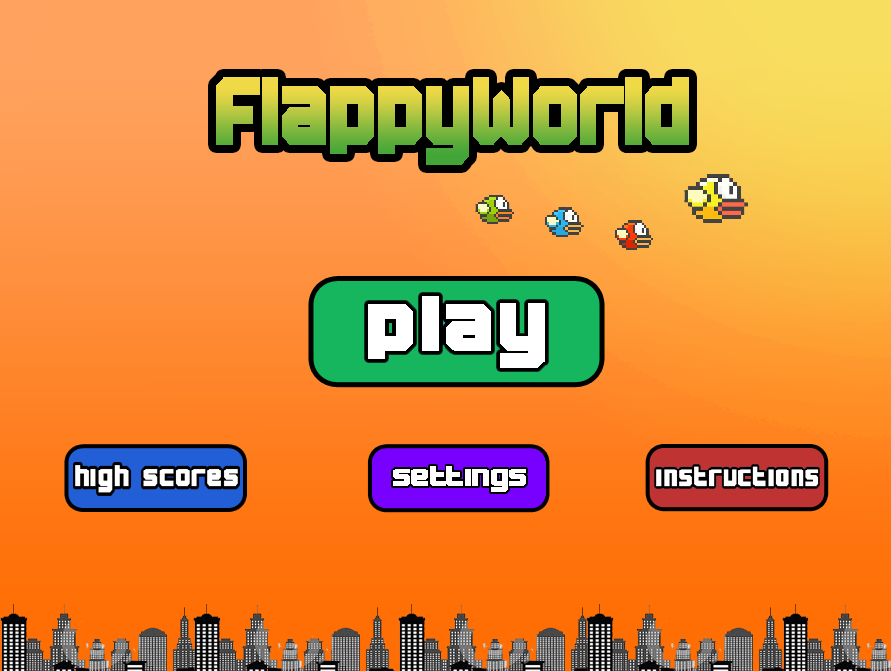
    </td>
  </tr>
</table>

Enjoy :) 
